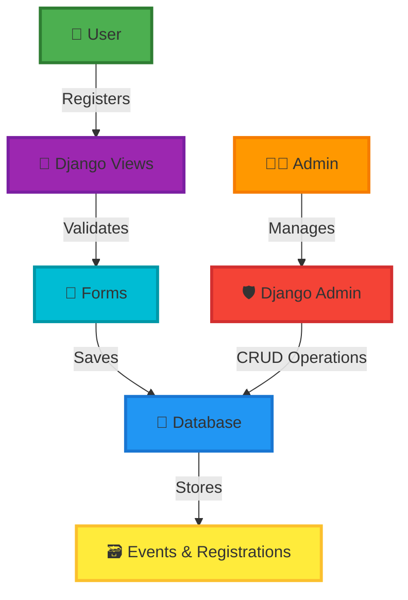
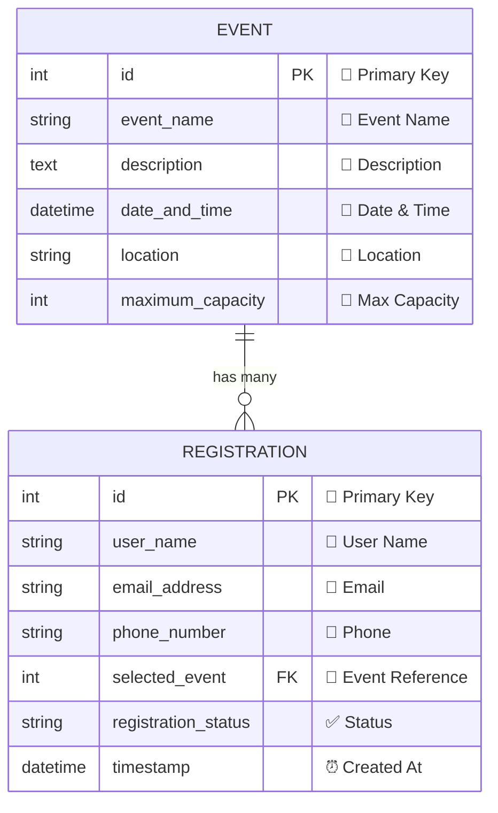

<div align="center">


### *A Modern, Feature-Rich Event Management Platform Built with Django*

<p align="center">
  <a href="https://www.djangoproject.com/">
    
  </a>
  <a href="https://www.python.org/">
    
  </a>
  <a href="https://getbootstrap.com/">
    
  </a>
  <a href="https://www.sqlite.org/">
    
  </a>
  <a href="https://opensource.org/licenses/MIT">
    
  </a>
</p>

<p align="center">
  <a href="#-demo">View Demo</a> •
  <a href="#-getting-started">Get Started</a> •
  <a href="#-features">Features</a> •
  <a href="https://github.com/koushik4475/EVENT-REGISTRATION-DJANGO-/issues">Report Bug</a> •
  <a href="https://github.com/koushik4475/EVENT-REGISTRATION-DJANGO-/issues">Request Feature</a>
</p>


</div>

<br>

## 📋 Table of Contents

- [✨ Features](#-features)
- [🎬 Demo](#-demo)
- [🏗️ Architecture](#️-architecture)
- [🚀 Getting Started](#-getting-started)
- [💻 Usage Guide](#-usage-guide)
- [🗄️ Database Schema](#️-database-schema)
- [🎨 Tech Stack](#-tech-stack)
- [🌐 Deployment](#-deployment)
- [🤝 Contributing](#-contributing)
- [📄 License](#-license)
- [👨‍💻 Author](#-author)

<br>

<div align="center">
  
</div>

<br>

## ✨ Features

<table>
<tr>
<td width="50%" valign="top">

<div align="center">
  
  
### 👥 User Experience

</div>

<br>

```diff
+ ✅ Seamless Registration Process
+ 🔍 Intuitive Event Discovery
+ 📧 Real-time Email Validation
+ ✔️ Instant Confirmation Feedback
+ 📱 Fully Responsive Design
+ 🎯 Easy-to-use Interface
+ ⚡ Lightning Fast Performance
```

</td>
<td width="50%" valign="top">

<div align="center">
  
  
### 🛡️ Admin Panel

</div>

<br>

```diff
+ 🎛️ Complete Management Control
+ 👤 Advanced User Management
+ ⚡ Quick Action Buttons
+ 📊 Powerful Bulk Operations
+ 🎯 Full CRUD for Events
+ 🔐 Secure Authentication
+ 📈 Registration Analytics
```

</td>
</tr>
</table>

<div align="center">
  
</div>

<br>

## 🎬 Demo

<div align="center">
  
</div>

### 🖼️ Application Screenshots

<details open>
<summary>
  <h3>🎯 Event Registration Form</h3>
  <i>👆 Click to expand/collapse</i>
</summary>
<br>

<div align="center">
  <a href="https://github.com/user-attachments/assets/7c382d81-7e2d-4e10-9ccd-36cb1cda9d41">
    
  </a>
  <p><b>📝 Clean and intuitive registration interface for seamless user experience</b></p>
</div>


</details>

<details>
<summary>
  <h3>✅ Registration Success Page</h3>
  <i>👆 Click to view</i>
</summary>
<br>

<div align="center">
  <a href="https://github.com/user-attachments/assets/8a5fcca0-d5e3-409f-a0ac-75092b122df3">
    
  </a>
  <p><b>🎉 Instant confirmation with beautiful success message</b></p>
</div>


</details>

<details>
<summary>
  <h3>➕ Admin Panel - Adding Events</h3>
  <i>👆 Click to view</i>
</summary>
<br>

<div align="center">
  <a href="https://github.com/user-attachments/assets/c7510cc3-3ac3-4eaf-ac38-3005695bf180">
    
  </a>
  <p><b>🎨 Streamlined event creation with powerful admin interface</b></p>
</div>


</details>

<details>
<summary>
  <h3>📋 Admin Panel - Event List</h3>
  <i>👆 Click to view</i>
</summary>
<br>

<div align="center">
  <a href="https://github.com/user-attachments/assets/ab23608e-37ae-476b-81b8-41ae32f9aa50">
    
  </a>
  <p><b>📊 Comprehensive overview with sortable columns and filters</b></p>
</div>


</details>

<details>
<summary>
  <h3>📝 Admin Panel - Managing Registrations</h3>
  <i>👆 Click to view</i>
</summary>
<br>

<div align="center">
  <a href="https://github.com/user-attachments/assets/6cdc284f-65d0-4fad-b795-c813bcda3fa3">
    
  </a>
  <p><b>⚡ Powerful registration management with bulk action capabilities</b></p>
</div>


</details>

<details>
<summary>
  <h3>🔐 Admin Login Page</h3>
  <i>👆 Click to view</i>
</summary>
<br>

<div align="center">
  <a href="https://github.com/user-attachments/assets/fc4bcb63-1c59-4421-89b9-67d1e6c558c8">
    
  </a>
  <p><b>🛡️ Secure authentication gateway for administrators</b></p>
</div>


</details>

<br>

<div align="center">
  
</div>

<br>

## 🏗️ Architecture

<div align="center">
  <br>
</div>



### 📁 Project Structure

```
📦 event-registration-system/
┃
┣ 📂 event_registration/          ⚙️  Main Django project
┃ ┣ 📄 settings.py                🔧 Project configuration
┃ ┣ 📄 urls.py                    🌐 URL routing
┃ ┗ 📄 wsgi.py                    🚀 WSGI configuration
┃
┣ 📂 events/                      💼 Core application
┃ ┣ 📄 models.py                  🗃️  Data models
┃ ┣ 📄 views.py                   👁️  Business logic (CBVs)
┃ ┣ 📄 forms.py                   📝 Form definitions
┃ ┣ 📄 admin.py                   ⚡ Admin customization
┃ ┗ 📂 templates/                 🎨 HTML templates
┃   ┣ 📄 base.html
┃   ┣ 📄 registration_form.html
┃   ┣ 📄 success.html
┃   ┗ 📄 event_list.html
┃
┣ 📂 static/                      🎭 Static assets
┃ ┣ 📂 css/
┃ ┣ 📂 js/
┃ ┗ 📂 images/
┃
┣ 📄 requirements.txt             📦 Dependencies
┣ 📄 manage.py                    🎮 Django CLI
┗ 📄 README.md                    📖 Documentation
```

<br>

<div align="center">
  
</div>

<br>

## 🚀 Getting Started

<div align="center">
  
</div>

### 📋 Prerequisites

<table>
<tr>
<td align="center" width="33%">
<br>
<b>Python 3.8+</b>
</td>
<td align="center" width="33%">
<br>
<b>pip</b>
</td>
<td align="center" width="33%">
<br>
<b>Git</b>
</td>
</tr>
</table>

### ⚡ Quick Start Installation

<details open>
<summary><b>📥 Follow These Steps</b></summary>
<br>

#### 1️⃣ Clone the Repository

```bash
git clone https://github.com/koushik4475/EVENT-REGISTRATION-DJANGO-.git
cd EVENT-REGISTRATION-DJANGO-
```

<div align="center">
  
</div>

#### 2️⃣ Create Virtual Environment

```bash
# Create virtual environment
python -m venv venv

# Activate virtual environment
# On Windows:
venv\Scripts\activate
# On macOS/Linux:
source venv/bin/activate
```

#### 3️⃣ Install Dependencies

```bash
pip install -r requirements.txt
```

#### 4️⃣ Database Setup

```bash
# Create database migrations
python manage.py makemigrations

# Apply migrations
python manage.py migrate
```

#### 5️⃣ Create Superuser

```bash
python manage.py createsuperuser
# Follow the prompts to set username, email, and password
```

#### 6️⃣ Run Development Server

```bash
python manage.py runserver
```

<div align="center">
  
</div>

#### 7️⃣ Access the Application

<table align="center">
<tr>
<td align="center">
<br>
<b>Main Site</b><br>
<a href="http://127.0.0.1:8000/">http://127.0.0.1:8000/</a>
</td>
<td align="center">
<br>
<b>Admin Panel</b><br>
<a href="http://127.0.0.1:8000/admin/">http://127.0.0.1:8000/admin/</a>
</td>
</tr>
</table>

</details>

<br>

<div align="center">
  
</div>

<br>

## 💻 Usage Guide

<table>
<tr>
<td width="50%">

### 👤 For End Users

 **Browse Events**
- Navigate to homepage
- View all available events

 **Register**
- Select your event
- Click "Register" button

 **Fill Form**
- Complete registration details
- Submit the form

 **Confirmation**
- Receive instant feedback
- Get success confirmation

</td>
<td width="50%">

### 👨‍💼 For Administrators

 **Login**
- Access `/admin/` endpoint
- Enter superuser credentials

 **Manage Registrations**
- View all registrations
- Approve/Reject/Pending status

 **Create Events**
- Navigate to Events section
- Add new events easily

 **Bulk Actions**
- Select multiple items
- Apply actions in bulk

</td>
</tr>
</table>

<br>

<div align="center">
  
</div>

<br>

## 🗄️ Database Schema

<div align="center">
  
</div>

### 📊 Entity Relationship Diagram



<details>
<summary><b>🗃️ View Model Details</b></summary>
<br>

### Event Model

```python
class Event(models.Model):
    event_name = CharField(max_length=200)
    description = TextField()
    date_and_time = DateTimeField()
    location = CharField(max_length=300)
    maximum_capacity = IntegerField()
```

### Registration Model

```python
class Registration(models.Model):
    user_name = CharField(max_length=100)
    email_address = EmailField()
    phone_number = CharField(max_length=15)
    selected_event = ForeignKey(Event)
    registration_status = CharField(
        choices=[
            ('pending', '⏳ Pending'), 
            ('approved', '✅ Approved'), 
            ('rejected', '❌ Rejected')
        ]
    )
    timestamp = DateTimeField(auto_now_add=True)
```

</details>

<br>

<div align="center">
  
</div>

<br>

## 🎨 Tech Stack

<div align="center">
  
  
  <h3>🛠️ Technologies Used</h3>
</div>

<table align="center">
<tr>
<td align="center" width="25%">
<br>
<sub><b>Backend</b></sub><br>


</td>
<td align="center" width="25%">
<br>
<sub><b>Frontend</b></sub><br>


</td>
<td align="center" width="25%">
<br>
<sub><b>Database</b></sub><br>


</td>
<td align="center" width="25%">
<br>
<sub><b>Tools</b></sub><br>


</td>
</tr>
</table>

### 🔑 Key Technical Highlights

<div align="center">

| Feature | Description |
|---------|-------------|
| ⚡ **Class-Based Views** | ListView, CreateView for clean, reusable code |
| 🔒 **Authentication** | Django's robust security framework |
| 🎯 **Form Validation** | Comprehensive validation on both sides |
| 🔗 **Database Relations** | ForeignKey relationships for data integrity |
| 🎨 **Responsive UI** | Bootstrap 5 for mobile-first design |
| 🔄 **URL Resolution** | Using `reverse_lazy()` for proper redirects |

</div>

<br>

<div align="center">
  
</div>

<br>

## 🌐 Deployment

<div align="center">
  
  
  <h3>☁️ Deploy Anywhere</h3>
</div>

<table align="center">
<tr>
<td align="center" width="25%">
<br>
<b>Heroku</b><br>
<sub>Easy deployment</sub>
</td>
<td align="center" width="25%">
<br>
<b>AWS EC2</b><br>
<sub>Scalable cloud</sub>
</td>
<td align="center" width="25%">
<br>
<b>DigitalOcean</b><br>
<sub>Simple setup</sub>
</td>
<td align="center" width="25%">
<br>
<b>PythonAnywhere</b><br>
<sub>Free hosting</sub>
</td>
</tr>
</table>

### 📝 Pre-Deployment Checklist

- [x] Update `ALLOWED_HOSTS` in settings.py
- [x] Set `DEBUG = False` for production
- [x] Configure environment variables
- [x] Set up PostgreSQL database
- [x] Collect static files: `python manage.py collectstatic`
- [x] Set up SSL certificate

<br>

<div align="center">
  
</div>

<br>

## 🤝 Contributing

<div align="center">
  
  
  <h3>💡 Contributions Welcome!</h3>
  <p>We love contributions! Help make this project even better.</p>
</div>

<details>
<summary><b>🚀 How to Contribute</b></summary>
<br>

### Step-by-Step Guide

1. **🍴 Fork the Project**
   ```bash
   Click the 'Fork' button at the top right
   ```

2. **📥 Clone Your Fork**
   ```bash
   git clone https://github.com/YOUR_USERNAME/EVENT-REGISTRATION-DJANGO-.git
   ```

3. **🌿 Create Feature Branch**
   ```bash
   git checkout -b feature/AmazingFeature
   ```

4. **✨ Make Your Changes**
   ```bash
   # Add your awesome code
   git add .
   ```

5. **💾 Commit Changes**
   ```bash
   git commit -m '✨ Add some AmazingFeature'
   ```

6. **🚀 Push to Branch**
   ```bash
   git push origin feature/AmazingFeature
   ```

7. **🎉 Open Pull Request**
   ```bash
   Go to your fork on GitHub and click 'New Pull Request'
   ```

</details>

<br>

<div align="center">

### 💡 Contribution Ideas

| Category | Ideas |
|----------|-------|
| 🎨 **UI/UX** | Improve design, add animations, enhance responsiveness |
| 🐛 **Bug Fixes** | Fix issues, improve error handling, optimize performance |
| 📝 **Documentation** | Improve README, add tutorials, create guides |
| ✨ **Features** | Email notifications, payment integration, QR codes |
| 🔧 **Code Quality** | Refactoring, testing, code optimization |

</div>

<br>

<div align="center">
  
</div>

<br>

## 📄 License

<div align="center">
  
  
  <h3>📜 MIT License</h3>
  <p>This project is open-source and free to use</p>
</div>

```
MIT License

Copyright (c) 2024 Koushik H Y

Permission is hereby granted, free of charge, to any person obtaining a copy
of this software and associated documentation files (the "Software"), to deal
in the Software without restriction, including without limitation the rights
to use, copy, modify, merge, publish, distribute, sublicense, and/or sell
copies of the Software, and to permit persons to whom the Software is
furnished to do so, subject to the following conditions:

The above copyright notice and this permission notice shall be included in all
copies or substantial portions of the Software.

✨ Feel free to use this project for personal or commercial purposes ✨
```

<br>

<div align="center">
  
</div>

<br>

## 👨‍💻 Author

<div align="center">
  
  
  <h2>Koushik H Y</h2>
  <p><i>Full Stack Developer | Django Enthusiast | Open Source Contributor</i></p>
  
  
</div>

<br>

<div align="center">
  
[](https://koushik4475.netlify.app)
[](mailto:koushik4475@gmail.com)
[](https://github.com/koushik4475)
[](https://linkedin.com/in/koushik4475)

</div>

<br>

<div align="center">
  
</div>

<br>

## 🌟 Show Your Support

<div align="center">
  
  
  <h3>⭐ Star This Repository!</h3>
  <p>If you found this project helpful, please give it a star!</p>
  
  <a href="https://github.com/koushik4475/EVENT-REGISTRATION-DJANGO-/stargazers">
    
  </a>
  <a href="https://github.com/koushik4475/EVENT-REGISTRATION-DJANGO-/network/members">
    
  </a>
  <a href="https://github.com/koushik4475/EVENT-REGISTRATION-DJANGO-/issues">
    
  </a>
  
  <br><br>
  
  
</div>

<br>

### 📊 Project Stats

<div align="center">
  


</div>

<br>

<div align="center">
  
</div>

<br>

## 📬 Get In Touch

<div align="center">
  
  
  <h3>💬 Questions or Feedback?</h3>
  <p>Feel free to reach out!</p>
  
  <table>
  <tr>
    <td align="center">
      <a href="https://github.com/koushik4475/EVENT-REGISTRATION-DJANGO-/issues">
        <br>
        <b>Report Issues</b>
      </a>
    </td>
    <td align="center">
      <a href="https://github.com/koushik4475/EVENT-REGISTRATION-DJANGO-/discussions">
        <br>
        <b>Discussions</b>
      </a>
    </td>
    <td align="center">
      <a href="mailto:koushik4475@gmail.com">
        <br>
        <b>Email Me</b>
      </a>
    </td>
  </tr>
  </table>
</div>

<br>

<div align="center">
  
</div>

<br>

<div align="center">
  
  
  <h2>🎉 Thank You for Visiting! 🎉</h2>
  
  
  
  <br><br>
  
  <p>
    
  </p>
  
  <br>
  
  **Built with ❤️ by Koushik H Y | © 2024 All Rights Reserved**
  
  <br>
  
  <a href="#top">
    
  </a>
</div>
