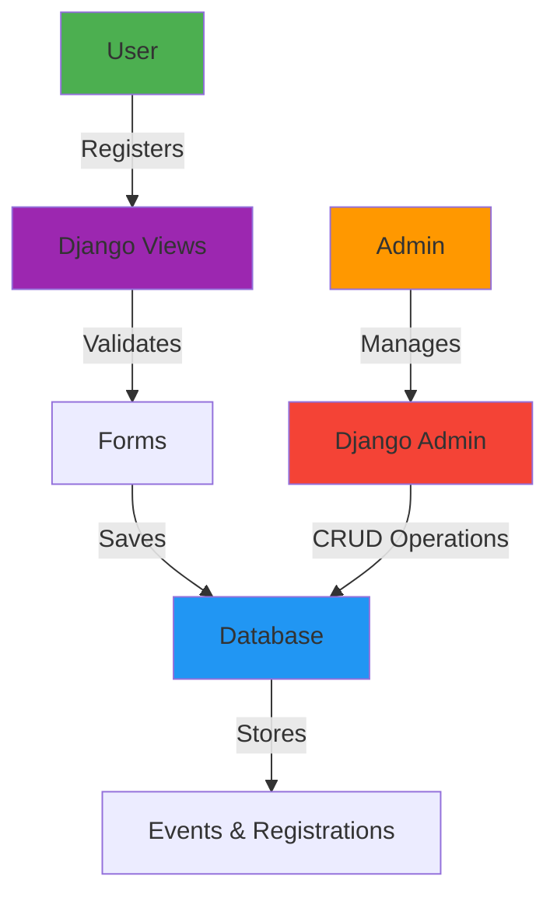
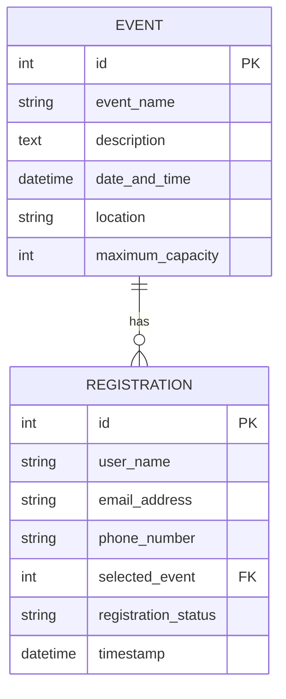

<div align="center">

# 🎉 Event Registration System

### *A Modern, Feature-Rich Event Management Platform Built with Django*

[](https://www.djangoproject.com/)
[](https://www.python.org/)
[](https://getbootstrap.com/)
[](https://www.sqlite.org/)
[](https://opensource.org/licenses/MIT)

[Live Demo](#) · [Report Bug](https://github.com/koushik4475/EVENT-REGISTRATION-DJANGO-/issues) · [Request Feature](https://github.com/koushik4475/EVENT-REGISTRATION-DJANGO-/issues)

---

### *Streamline your event management with powerful registration tools and an intuitive admin interface*

</div>

<br>

## 📋 Table of Contents

- [✨ Features](#-features)
- [🎬 Demo](#-demo)
- [🏗️ Architecture](#️-architecture)
- [🚀 Getting Started](#-getting-started)
- [💻 Usage Guide](#-usage-guide)
- [🗄️ Database Schema](#️-database-schema)
- [🎨 Tech Stack](#-tech-stack)
- [🌐 Deployment](#-deployment)
- [🤝 Contributing](#-contributing)
- [📄 License](#-license)
- [👨‍💻 Author](#-author)

<br>

---

<br>

## ✨ Features

<table>
<tr>
<td width="50%">

### 👥 User Experience
- ✅ **Seamless Registration** - Intuitive event registration process
- 🔍 **Event Discovery** - Browse and explore available events
- 📧 **Email Validation** - Real-time form validation
- ✔️ **Instant Confirmation** - Immediate registration feedback
- 📱 **Responsive Design** - Works flawlessly on all devices

</td>
<td width="50%">

### 🛡️ Admin Panel
- 🎛️ **Complete Control** - Comprehensive Django admin interface
- 👤 **User Management** - View and manage all registrations
- ⚡ **Quick Actions** - Approve/Reject/Pending status updates
- 📊 **Bulk Operations** - Handle multiple registrations at once
- 🎯 **Event Management** - Full CRUD operations for events

</td>
</tr>
</table>

<br>

---

<br>

## 🎬 Demo

### 🖼️ Application Screenshots

<details open>
<summary><b>🎯 Event Registration Form</b> (Click to expand/collapse)</summary>
<br>

<div align="center">
  
  <p><i>Clean and intuitive registration interface for users</i></p>
</div>

</details>

<details>
<summary><b>✅ Registration Success Page</b></summary>
<br>

<div align="center">
  
  <p><i>Confirmation page displaying successful registration</i></p>
</div>

</details>

<details>
<summary><b>➕ Admin - Adding Events</b></summary>
<br>

<div align="center">
  
  <p><i>Streamlined event creation interface</i></p>
</div>

</details>

<details>
<summary><b>📋 Admin - Event List</b></summary>
<br>

<div align="center">
  
  <p><i>Comprehensive overview of all events</i></p>
</div>

</details>

<details>
<summary><b>📝 Admin - Managing Registrations</b></summary>
<br>

<div align="center">
  
  <p><i>Powerful registration management with bulk actions</i></p>
</div>

</details>

<details>
<summary><b>🔐 Admin Login Page</b></summary>
<br>

<div align="center">
  
  <p><i>Secure authentication for administrators</i></p>
</div>

</details>

<br>

---

<br>

## 🏗️ Architecture



### 📁 Project Structure

```
event-registration-system/
│
├── 📂 event_registration/          # Main Django project
│   ├── ⚙️ settings.py              # Project configuration
│   ├── 🌐 urls.py                  # URL routing
│   └── 🚀 wsgi.py                  # WSGI configuration
│
├── 📂 events/                      # Core application
│   ├── 🗃️ models.py                # Data models
│   ├── 👁️ views.py                 # Business logic (CBVs)
│   ├── 📝 forms.py                 # Form definitions
│   ├── ⚡ admin.py                 # Admin customization
│   └── 📂 templates/               # HTML templates
│       ├── base.html
│       ├── registration_form.html
│       ├── success.html
│       └── event_list.html
│
├── 📂 static/                      # Static assets
│   ├── css/
│   ├── js/
│   └── images/
│
├── 📄 requirements.txt             # Dependencies
├── 📋 manage.py                    # Django CLI
└── 📖 README.md                    # Documentation
```

<br>

---

<br>

## 🚀 Getting Started

### 📋 Prerequisites

Before you begin, ensure you have the following installed:

```bash
Python 3.8+
pip (Python package manager)
Git
```

### ⚡ Quick Start

<details open>
<summary><b>Installation Steps</b></summary>

#### 1️⃣ Clone the Repository

```bash
git clone https://github.com/koushik4475/EVENT-REGISTRATION-DJANGO-.git
cd EVENT-REGISTRATION-DJANGO-
```

#### 2️⃣ Create Virtual Environment

```bash
# Create virtual environment
python -m venv venv

# Activate virtual environment
# On Windows:
venv\Scripts\activate
# On macOS/Linux:
source venv/bin/activate
```

#### 3️⃣ Install Dependencies

```bash
pip install -r requirements.txt
```

#### 4️⃣ Database Setup

```bash
# Create database migrations
python manage.py makemigrations

# Apply migrations
python manage.py migrate
```

#### 5️⃣ Create Superuser

```bash
python manage.py createsuperuser
# Follow the prompts to set username, email, and password
```

#### 6️⃣ Run Development Server

```bash
python manage.py runserver
```

#### 7️⃣ Access the Application

- **🌐 Main Site:** http://127.0.0.1:8000/
- **🔐 Admin Panel:** http://127.0.0.1:8000/admin/

</details>

<br>

---

<br>

## 💻 Usage Guide

### 👤 For End Users

1. **Browse Events** - Navigate to the homepage to view all available events
2. **Select Event** - Choose an event and click the "Register" button
3. **Fill Form** - Complete the registration form with your details
4. **Submit** - Click submit and receive instant confirmation
5. **Confirmation** - You'll be redirected to a success page

### 👨‍💼 For Administrators

<table>
<tr>
<th>Action</th>
<th>Steps</th>
</tr>
<tr>
<td><b>Login</b></td>
<td>Access <code>/admin/</code> and enter superuser credentials</td>
</tr>
<tr>
<td><b>Manage Registrations</b></td>
<td>Navigate to <b>Registrations</b> → Select entries → Choose action (Approve/Reject/Pending)</td>
</tr>
<tr>
<td><b>Create Events</b></td>
<td>Go to <b>Events</b> → Click "Add Event" → Fill details → Save</td>
</tr>
<tr>
<td><b>Bulk Actions</b></td>
<td>Select multiple registrations → Choose bulk action from dropdown → Apply</td>
</tr>
</table>

<br>

---

<br>

## 🗄️ Database Schema

### 📊 Entity Relationship Diagram



### 📝 Model Details

<details>
<summary><b>Event Model</b></summary>

```python
class Event(models.Model):
    event_name = CharField(max_length=200)
    description = TextField()
    date_and_time = DateTimeField()
    location = CharField(max_length=300)
    maximum_capacity = IntegerField()
```

</details>

<details>
<summary><b>Registration Model</b></summary>

```python
class Registration(models.Model):
    user_name = CharField(max_length=100)
    email_address = EmailField()
    phone_number = CharField(max_length=15)
    selected_event = ForeignKey(Event)
    registration_status = CharField(
        choices=[('pending', 'Pending'), 
                ('approved', 'Approved'), 
                ('rejected', 'Rejected')]
    )
    timestamp = DateTimeField(auto_now_add=True)
```

</details>

<br>

---

<br>

## 🎨 Tech Stack

<div align="center">

| Category | Technologies |
|----------|-------------|
| **Backend** |   |
| **Frontend** |    |
| **Database** |   |
| **Tools** |   |

</div>

### 🔑 Key Technical Highlights

- ⚡ **Class-Based Views (CBVs)** - ListView, CreateView for clean, reusable code
- 🔒 **Built-in Authentication** - Django's robust security framework
- 🎯 **Form Validation** - Comprehensive client and server-side validation
- 🔗 **Database Relations** - ForeignKey relationships for data integrity
- 🎨 **Responsive UI** - Bootstrap 5 for mobile-first design
- 🔄 **Reverse URL Resolution** - Using `reverse_lazy()` for proper redirects

<br>

---

<br>

## 🌐 Deployment

This application is deployment-ready for various platforms:

<table>
<tr>
<td align="center" width="25%">
<br>
<b>Heroku</b>
</td>
<td align="center" width="25%">
<br>
<b>AWS EC2</b>
</td>
<td align="center" width="25%">
<br>
<b>DigitalOcean</b>
</td>
<td align="center" width="25%">
<br>
<b>PythonAnywhere</b>
</td>
</tr>
</table>

### 📝 Pre-Deployment Checklist

- [ ] Update `ALLOWED_HOSTS` in settings.py
- [ ] Set `DEBUG = False` for production
- [ ] Configure environment variables
- [ ] Set up PostgreSQL database
- [ ] Collect static files: `python manage.py collectstatic`
- [ ] Set up SSL certificate

<br>

---

<br>

## 🤝 Contributing

Contributions make the open-source community an amazing place to learn, inspire, and create. Any contributions you make are **greatly appreciated**!

<details>
<summary><b>How to Contribute</b></summary>

1. **Fork the Project**
2. **Create your Feature Branch**
   ```bash
   git checkout -b feature/AmazingFeature
   ```
3. **Commit your Changes**
   ```bash
   git commit -m 'Add some AmazingFeature'
   ```
4. **Push to the Branch**
   ```bash
   git push origin feature/AmazingFeature
   ```
5. **Open a Pull Request**

</details>

### 💡 Contribution Ideas

- 🎨 UI/UX improvements
- 🐛 Bug fixes
- 📝 Documentation enhancements
- ✨ New features
- 🔧 Code optimization

<br>

---

<br>

## 📄 License

Distributed under the **MIT License**. See `LICENSE` for more information.

```
MIT License - feel free to use this project for personal or commercial purposes
```

<br>

---

<br>

## 👨‍💻 Author

<div align="center">

### **Koushik H Y**
*Full Stack Developer | Django Enthusiast | Open Source Contributor*

[](https://koushik4475.netlify.app)
[](mailto:koushik4475@gmail.com)
[](https://github.com/koushik4475)

<br>

---

<br>

### 🌟 Show Your Support

If you found this project helpful, please consider giving it a ⭐ on GitHub!

**Made with ❤️ and Django**

<a href="https://github.com/koushik4475/EVENT-REGISTRATION-DJANGO-/stargazers">

</a>
<a href="https://github.com/koushik4475/EVENT-REGISTRATION-DJANGO-/network/members">

</a>

</div>

<br>

---

<div align="center">

### 📬 Questions or Feedback?

Feel free to [open an issue](https://github.com/koushik4475/EVENT-REGISTRATION-DJANGO-/issues) or reach out directly!

**Happy Coding! 🚀**

</div>
